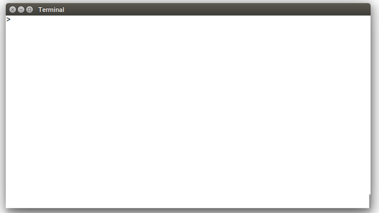

# Screencast 10fps


# Screencast 5fps


# Script

see fibonacci/script

# Record video
* Terminal:
 * 81x24 (best to fit into Youtube 854x480 video)
 * font: Liberation Mono Regular 12pt
 * color scheme: Built-in "Black on White"
 * no ~/.vimrc
 * export PS1="> "
* Record video with asciinema
```
cd fibonacci
asciinema rec movie.json
```
* Edit timing and pauses
* Play recorded asciinema episode
```
asciinema play movie.json
```

# Record video with kazam

* format: Lossleass AVI (best for GIF)
* size 854x480 (best for youtube)
result will be ~ 3.5Gb

# Create GIF
http://blog.pkh.me/p/21-high-quality-gif-with-ffmpeg.html

```
# Palette generation from the number of frames
ffmpeg -y -ss 30 -t 3 -i Screencast\ 2017-06-01\ 20:05:18.avi \
-vf fps=10,scale=640:-1:flags=lanczos,palettegen palette.png

# Convert to 10 fps GIF 640x360
# ~ 1.2Mb
ffmpeg -i Screencast\ 2017-06-01\ 20:05:18.avi -i palette.png -filter_complex \
"fps=10,scale=640:-1:flags=lanczos[x];[x][1:v]paletteuse" output.gif

# Convert 5fps fps GIF 640x360
# ~ 1Mb
ffmpeg -i Screencast\ 2017-06-01\ 20:05:18.avi -i palette.png -filter_complex \
"fps=10,scale=640:-1:flags=lanczos[x];[x][1:v]paletteuse" output.gif
```

Alternative: https://github.com/thevangelist/FFMPEG-gif-script-for-bash
